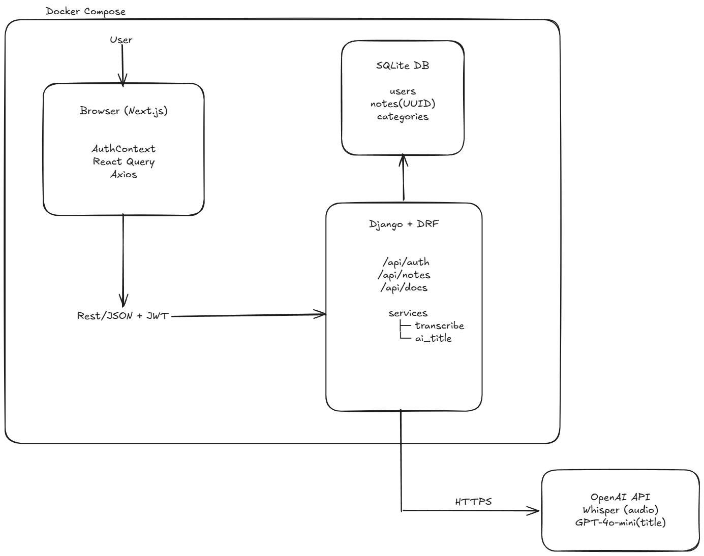

# Turbo Notes

> A Notion-style notes app with AI-powered audio transcription and auto-title generation, built for Turbo AI's Senior Full Stack Engineer hiring challenge.

---

## 📺 Demo Video

A 3–5 minute walkthrough covering architecture, main flows, and AI features.

[▶ Watch 5-minute walkthrough](#)

## 🔗 Repository

[github.com/paulo-cardoso71/turbo-ai-notes](https://github.com/paulo-cardoso71/turbo-ai-notes)

---

## ✨ Features

| Feature                                           | Status |
| ------------------------------------------------- | ------ |
| Email/password authentication (JWT)               | ✅     |
| Create, edit, delete notes                        | ✅     |
| Auto-save (1s debounce — no save button needed)   | ✅     |
| Categorize notes with color-coded categories      | ✅     |
| Masonry/grid layout                               | ✅     |
| Audio recording → AI transcription → text in note | ✅     |
| AI auto-title generation from note content        | ✅     |
| Filter notes by category                          | ✅     |
| Responsive design                                 | ✅     |
| Swagger API documentation                         | ✅     |
| Docker Compose for one-command setup              | ✅     |
| Search notes by title and content                 | ✅     |

---

## 🚀 Quick Start (Docker — Recommended)

```bash
git clone https://github.com/paulo-cardoso71/turbo-ai-notes.git
cd turbo-ai-notes
cp backend/.env.example backend/.env
# Fill in TRANSCRIPTION_API_KEY in backend/.env
docker-compose up --build
```

- Frontend: http://localhost:3000
- Backend API: http://localhost:8000/api
- Swagger docs: http://localhost:8000/api/docs/

---

## 🛠️ Manual Setup

### Backend

```bash
cd backend
python -m venv venv
venv\Scripts\activate       # Windows
# source venv/bin/activate  # Mac/Linux
pip install -r requirements.txt
cp .env.example .env
# Fill in your values in .env
python manage.py migrate
python manage.py runserver
```

### Frontend

```bash
cd frontend
npm install
cp .env.local.example .env.local
npm run dev
```

---

## ⚙️ Environment Variables

### `backend/.env`

```env
SECRET_KEY=your-secret-key-here
DEBUG=True
ALLOWED_HOSTS=localhost,127.0.0.1
TRANSCRIPTION_API_KEY=sk-your-openai-key-here
```

### `frontend/.env.local`

```env
NEXT_PUBLIC_API_URL=http://127.0.0.1:8000/api
```

---

## 🏗️ Architecture



---

## 🧠 Technical Decisions & Trade-offs

### 1. Email-only authentication (no username)

**Decision:** Custom `AbstractBaseUser` with `email` as `USERNAME_FIELD`.

**Rationale:** The Figma shows only email/password fields. Django's default `username` field would have required workarounds. Overriding from the start is the correct pattern, changing the user model after initial migrations is painful and risky.

**Trade-off:** Slightly more boilerplate upfront. Eliminates all downstream migration complexity.

### 2. JWT over Django Sessions

**Decision:** `djangorestframework-simplejwt` for stateless JWT authentication.

**Rationale:** The frontend is a separate Next.js app on a different port. Session-based auth requires cookie sharing across origins, which adds CSRF complexity. JWT stored in `httpOnly` cookies gives us stateless auth that works cleanly across origins.

**Trade-off:** Token refresh logic required. No server-side session invalidation (mitigated by short access token lifetime: 1 day).

### 3. UUID primary keys for Notes

**Decision:** `UUIDField` as primary key instead of sequential integers.

**Rationale:** Sequential IDs leak information, a user can guess `/api/notes/1/` and attempt to access other users' data. UUIDs are unguessable. Defense in depth alongside the user-scoped queryset filter.

**Trade-off:** Slightly larger index size. Negligible at this scale.

### 4. Stateless audio transcription

**Decision:** Audio files are never stored. Receive → transcribe → return text → discard.

**Rationale:** Audio files are large and expensive to store. We don't need playback — only the text. This eliminates storage infrastructure, reduces attack surface, and sidesteps GDPR/privacy concerns around storing voice recordings.

**Trade-off:** No audio history. Users cannot replay their recordings. Acceptable for a notes app.

### 5. Service layer for external API calls

**Decision:** All OpenAI calls isolated in `services/transcription.py` and `services/ai_title.py`.

**Rationale:** Views should be thin. If OpenAI changes their API or we switch providers, we change one file. The view doesn't care how transcription works, only that it returns a string.

**Trade-off:** Extra abstraction layer. Justified because external API contracts change.

### 6. Auto-save with 1s debounce (no save button)

**Decision:** Notion style auto-save triggered 1 second after the user stops typing.

**Rationale:** Eliminates cognitive load, users never lose work. Matches modern note-taking UX patterns. The save on close safety net catches any state missed by the debounce timer.

**Trade-off:** More API calls than explicit save. At this scale it's fine. At 100k users, we'd batch updates or use WebSockets.

### 7. React Query over Redux/Zustand

**Decision:** `@tanstack/react-query` for server state, React Context for auth state only.

**Rationale:** Redux/Zustand for two pieces of global state (tokens + email) is severe over-engineering. React Query handles caching, refetching, and invalidation for server data. Right tool for each job.

**Trade-off:** Two systems to understand. The separation is intentional and documented.

### 8. CSS Columns for masonry layout

**Decision:** Pure CSS `columns` property instead of a JavaScript masonry library.

**Rationale:** CSS columns achieves the masonry effect with zero JavaScript, zero dependencies, zero layout calculation. Performant, simple, maintainable.

**Trade-off:** Column-first ordering (top-to-bottom then left-to-right) instead of row-first. Acceptable for a notes app where chronological order is less critical than visual density.

### 9. SQLite for development → PostgreSQL for production

**Decision:** SQLite in dev, documented PostgreSQL switch for production.

**Rationale:** SQLite requires zero infrastructure, enabling instant setup. The PostgreSQL migration is a single `settings.py` change (already documented). Don't add infrastructure complexity before it's needed.

**Trade-off:** SQLite doesn't perfectly replicate PostgreSQL behaviour (e.g. case sensitivity in LIKE queries). Run integration tests against PostgreSQL in CI before deploying.

### 10. Pre-seeded categories (not user-created)

**Decision:** 3 global categories seeded via a data migration. No category management UI.

**Rationale:** The Figma shows fixed categories. Building a category CRUD system would cost 2+ hours for a feature nobody asked for. The seed migration is idempotent, safe to run multiple times.

**Trade-off:** Users cannot create custom categories. Clear scope decision for a 72-hour challenge.

### 11. OpenAI Whisper over AssemblyAI

**Decision:** OpenAI Whisper API for audio transcription.

**Rationale:** Single synchronous API call vs. AssemblyAI's two-step async flow (upload → poll). Less code, fewer failure points, faster response. Both OpenAI integrations (Whisper + GPT) share one API key and one SDK.

**Trade-off:** Small cost per minute of audio (~$0.006/min). Acceptable for this use case.

---

## 📐 API Reference

Full interactive documentation available at `http://localhost:8000/api/docs/` (Swagger UI) when the server is running.

### Auth

```
POST /api/auth/register/   {email, password} → {email, tokens}
POST /api/auth/login/      {email, password} → {email, tokens}
POST /api/auth/refresh/    {refresh}         → {access}
```

### Categories

```
GET /api/categories/   → [{id, name, color}]
```

### Notes (all require Authorization: Bearer <token>)

```
GET    /api/notes/              List notes (filter: ?category=id)
POST   /api/notes/              Create note
GET    /api/notes/:id/          Get note
PATCH  /api/notes/:id/          Update note (partial)
DELETE /api/notes/:id/          Delete note
POST   /api/notes/transcribe/   Audio → text (multipart/form-data)
POST   /api/notes/generate-title/ {content} → {title}
```

---

## 🧪 Testing

```bash
cd backend
python manage.py test
```

**20 tests. All passing.**

```
accounts/ — 6 tests
  ✅ Register with valid credentials returns tokens
  ✅ Register with duplicate email returns 400
  ✅ Register without email returns 400
  ✅ Login with valid credentials returns tokens
  ✅ Login with wrong password returns 401
  ✅ Login with nonexistent email returns 401, same error prevents email enumeration

notes/ — 11 tests
  ✅ Unauthenticated request returns 401
  ✅ User can create a note
  ✅ User only sees their own notes                      ← SECURITY
  ✅ User cannot access another user's note by UUID      ← SECURITY
  ✅ User can update their own note
  ✅ User cannot update another user's note              ← SECURITY
  ✅ User can delete their own note
  ✅ Category filter returns correct notes only
  ✅ Search filters notes by title
  ✅ AI title endpoint rejects empty content
  ✅ AI title endpoint requires authentication

categories/ — 3 tests
  ✅ Authenticated user can list categories
  ✅ Categories have correct fields (id, name, color)
  ✅ Unauthenticated user cannot list categories
```

---

## 🐳 Docker

```yaml
# docker-compose.yml
services:
  backend: Django on port 8000
  frontend: Next.js on port 3000
```

```bash
docker-compose up --build    # start everything
docker-compose down          # stop
docker-compose logs backend  # view backend logs
```

---

## 📈 What I'd Improve With More Time

| Improvement                      | Why                                        |
| -------------------------------- | ------------------------------------------ |
| WebSocket for real-time sync     | Notes update across tabs/devices instantly |
| Rich text editor                 | Markdown, bullet points, formatting        |
| Note sharing / collaboration     | Multi-user editing                         |
| Rate limiting on transcription   | Prevent API abuse and runaway costs        |
| Redis caching for categories     | Avoid DB hit on every page load            |
| S3 for optional file attachments | Future attachment support                  |
| Full test coverage (>80%)        | Currently covers critical paths only       |
| Refresh token rotation           | Better security posture                    |
| CI/CD pipeline (GitHub Actions)  | Automated test + deploy on push            |
| PostgreSQL in Docker Compose     | Production-parity dev environment          |

---

## 🤖 AI Usage Log

This project was built using Claude (claude.ai) as a pair programming assistant throughout the 72-hour challenge. Here is a short summary of every phase, what AI generated, what I decided, what I diagnosed, what I rejected.

This log exists because AI usage is part of the evaluation.

---

**What AI did:** Initial Django scaffolding, component boilerplate, SDK syntax, and configuration patterns. Accelerated implementation
of decisions already made.

**What I did:** Every architectural decision, all security design, (UUID keys, user-scoped querysets, enumeration prevention), all bug diagnosis (Turbopack path crash, InMemoryUploadedFile tuple conversion, Whisper language detection, test double-seeding, Docker CMD mismatch), scope decisions, test strategy, data model, and UI design system.

Every decision in the Technical Decisions section above was mine.

[→ Full AI usage log with phase by phase breakdown](docs/AI_USAGE.md)

---

### The Full Summary

| Category                                                                                                                     | Human | AI  |
| ---------------------------------------------------------------------------------------------------------------------------- | ----- | --- |
| All 15 architectural decisions                                                                                               | ✅    | ❌  |
| Security design (UUID, isolation, enumeration prevention)                                                                    | ✅    | ❌  |
| Scope decisions (what to build vs cut)                                                                                       | ✅    | ❌  |
| All bug diagnosis (Turbopack path, InMemoryUploadedFile, Korean transcription, seed double-creation, next start vs next dev) | ✅    | ❌  |
| Data model design                                                                                                            | ✅    | ❌  |
| Test strategy and SECURITY tests                                                                                             | ✅    | ❌  |
| UI design decisions (color system, font, icon approach)                                                                      | ✅    | ❌  |
| What to reject from AI suggestions                                                                                           | ✅    | ❌  |
| Boilerplate and scaffolding                                                                                                  | ❌    | ✅  |
| SDK patterns (after human diagnosis)                                                                                         | ❌    | ✅  |
| Syntax and configuration lookup                                                                                              | ❌    | ✅  |

---

### How AI was used

AI was used as a tool to accelerate implementation of decisions already made, not to make decisions. Every AI suggestion was reviewed before being applied. Several were rejected or modified. This is the way i see how to integrate AI into a professional engineering workflow.

---

## 👤 Author

**Paulo Cardoso**
Full Stack Engineer. I built this application as a demonstration of adaptability, engineering judgment, and correct AI-augmented development.

[LinkedIn](https://www.linkedin.com/in/paulo-cardoso71/)
